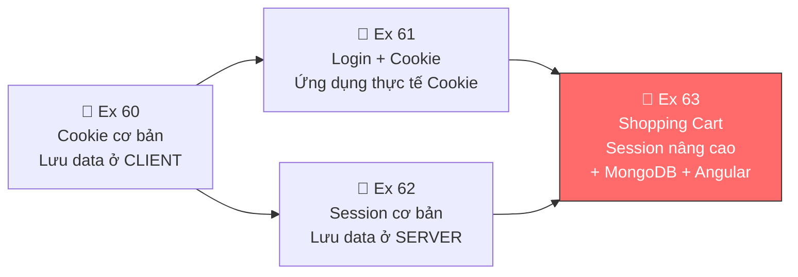
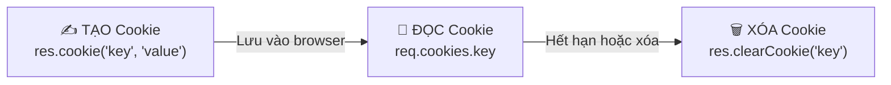
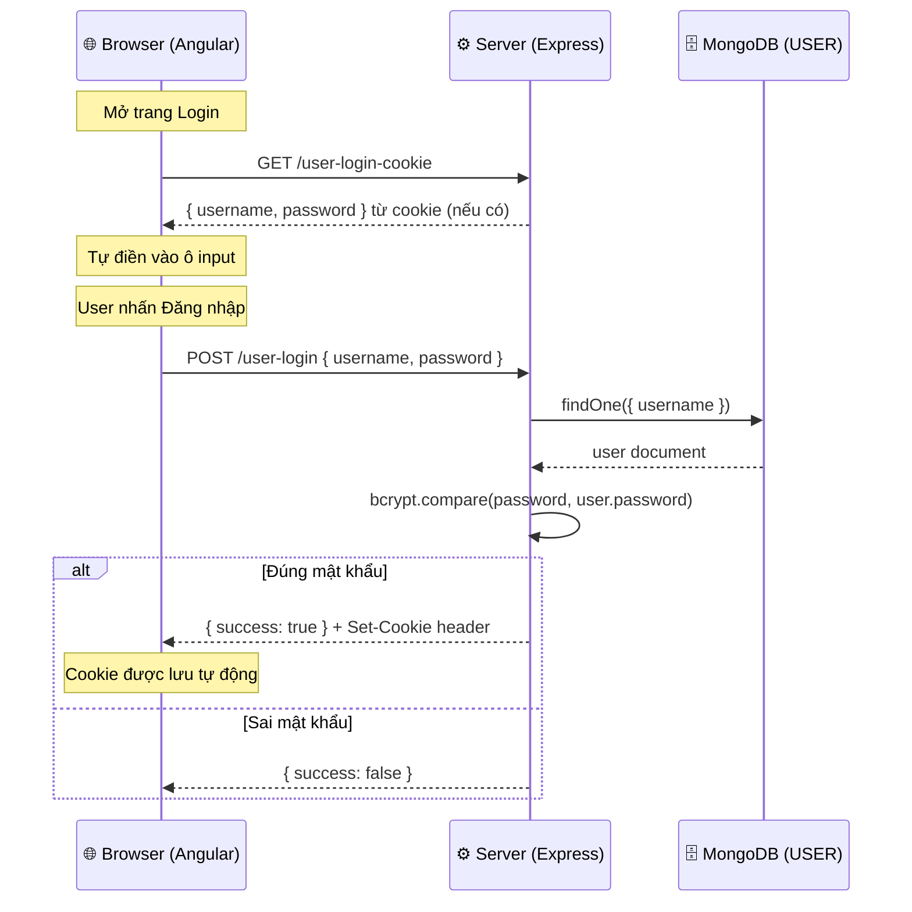
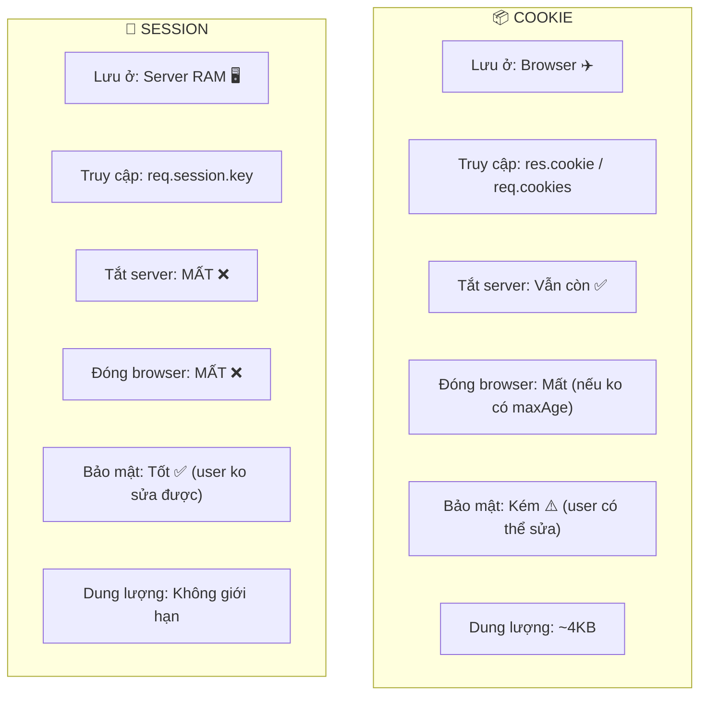
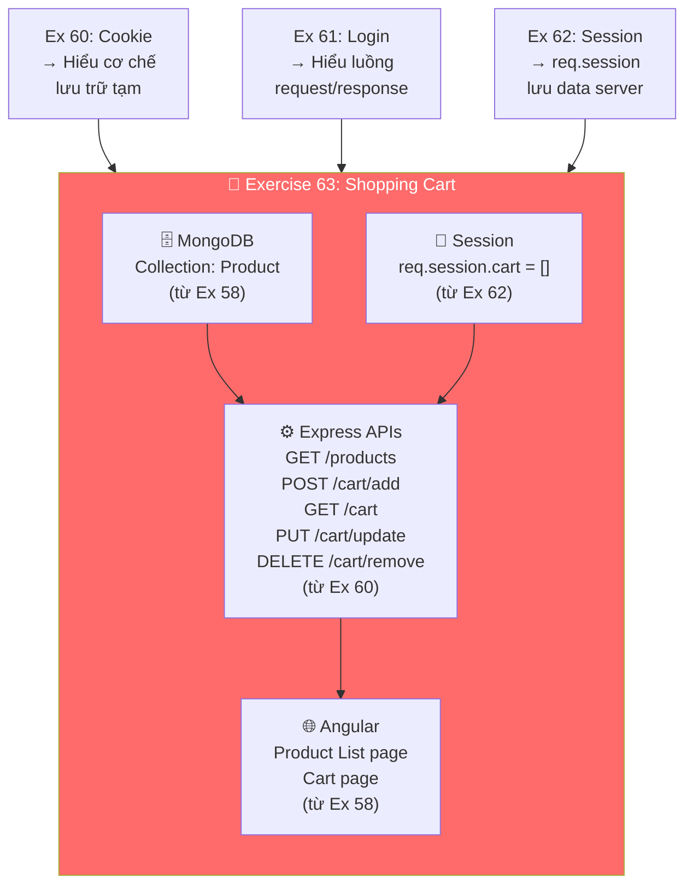

# 📚 Ôn tập Exercise 60 → 62 — Chuẩn bị cho Exercise 63

> Bài 60 → 62 là **nền tảng kiến thức** cho bài tập lớn Exercise 63 (Shopping Cart).  
> Mỗi bài dạy 1 kỹ thuật lưu trữ dữ liệu tạm thời trên web.

---

## 🔗 Mối liên hệ giữa các bài



---

## 📗 Exercise 60 — Cookie Programming

### Cookie là gì?
Cookie là **dữ liệu nhỏ được lưu ở trình duyệt (client)**. Server gửi cookie → browser lưu → browser gửi lại cookie mỗi lần request.

### Cài đặt
```bash
npm install --save cookie-parser
```

### Code trong dự án — [Index.js](file:///d:/K234112E/my-server-mongodb/Index.js#L14-L15)

```javascript
var cookieParser = require('cookie-parser');
app.use(cookieParser());  // Middleware để đọc cookie
```

### 3 thao tác chính với Cookie



| API | Method | Code quan trọng | Giải thích |
|-----|--------|----------------|------------|
| `/create-cookie` | GET | `res.cookie("username", "tranduythanh")` | Server gửi cookie cho browser lưu |
| `/read-cookie` | GET | `req.cookies.username` | Server đọc cookie từ request browser gửi lên |
| `/clear-cookie` | GET | `res.clearCookie("account")` | Server bảo browser xóa cookie |

### Cookie có thời hạn
```javascript
// Cách 1: expire — mốc thời gian hết hạn
res.cookie("infor_limit1", 'value', { expire: 360000 + Date.now() });

// Cách 2: maxAge — sống bao lâu (ms)
res.cookie("infor_limit2", 'value', { maxAge: 360000 });  // 6 phút

// Cookie không thời hạn → mất khi đóng browser
res.cookie("username", "tranduythanh")
```

### 💡 Điểm cần nhớ cho thi
- Cookie lưu **ở client** → dùng `res` để gửi, `req` để đọc
- Cookie có thể lưu **string** hoặc **object** (`res.cookie("account", {username, password})`)
- Tắt server → cookie **vẫn còn** (vì nằm ở browser)
- Đóng browser → cookie **không thời hạn** sẽ mất

---

## 📘 Exercise 61 — Login + Cookie (Ứng dụng thực tế)

### Bài toán
Khi user đăng nhập thành công → **lưu username/password vào cookie** → lần sau mở trang login → **tự điền sẵn** (Remember Me).

### Luồng hoạt động



### Code quan trọng — [Index.js](file:///d:/K234112E/my-server-mongodb/Index.js#L34-L62)

```javascript
// ĐĂNG NHẬP — kiểm tra password bằng bcrypt, lưu cookie nếu đúng
app.post("/user-login", cors(), async (req, res) => {
    const { username, password } = req.body;
    const user = await userCollection.findOne({ username });
    const isMatch = await bcrypt.compare(password, user.password);
    if (isMatch) {
        // ⭐ Lưu cookie 7 ngày
        res.cookie("login_username", username, { maxAge: 7*24*60*60*1000 });
        res.cookie("login_password", password, { maxAge: 7*24*60*60*1000 });
        res.send({ success: true });
    }
})

// ĐỌC COOKIE — Angular gọi khi mở trang login
app.get("/user-login-cookie", cors(), (req, res) => {
    res.send({
        username: req.cookies.login_username || "",
        password: req.cookies.login_password || ""
    });
})
```

### 💡 Điểm cần nhớ
- Dùng **bcrypt** để hash password (không lưu plain text trong DB)
- `bcrypt.compare(plainText, hashedText)` → trả về `true/false`
- Cookie maxAge `7*24*60*60*1000` ms = **7 ngày**

---

## 📙 Exercise 62 — Session Programming

### Session là gì?
Session là **dữ liệu được lưu trên server** (RAM). Mỗi browser được cấp 1 session ID (qua cookie) để server nhận diện.

### So sánh Cookie vs Session



| Tiêu chí | Cookie | Session |
|----------|--------|---------|
| **Lưu ở đâu** | Browser (client) | Server (RAM) |
| **Truy cập** | `req.cookies` / `res.cookie()` | `req.session` |
| **Tắt server** | Vẫn còn ✅ | **MẤT** ❌ |
| **Đóng browser** | Tuỳ maxAge | **MẤT** ❌ |
| **Bảo mật** | Kém (user sửa được) | Tốt (server giữ) |
| **Kích thước** | ~4KB/cookie | Không giới hạn |
| **Dùng cho** | Remember me, preferences | Giỏ hàng, phiên đăng nhập |

### Cài đặt
```bash
npm install --save express-session
```

### Code — [Index.js](file:///d:/K234112E/my-server-mongodb/Index.js#L17-L19)

```javascript
var session = require('express-session');
app.use(session({ secret: "Shh, its a secret!" }));
// secret = chuỗi bí mật dùng để mã hóa session ID
```

### API đếm lượt truy cập — [Index.js](file:///d:/K234112E/my-server-mongodb/Index.js#L120-L128)

```javascript
app.get("/contact", cors(), (req, res) => {
    if (req.session.visited != null) {
        req.session.visited++    // ⭐ Tăng biến session
        res.send("You visited this page " + req.session.visited + " times")
    } else {
        req.session.visited = 1  // ⭐ Lần đầu = khởi tạo
        res.send("Welcome to this page for the first time!")
    }
})
```

### 💡 Điểm cần nhớ
- `req.session` là **object**, lưu bất kỳ data gì: string, number, array, object
- Mỗi browser có **session riêng** (Chrome vs Firefox = 2 session khác nhau)
- Session **mất** khi: restart server, đóng browser, hoặc hết timeout
- `secret` dùng để **ký** (sign) session ID cookie → chống giả mạo

---

## 🎯 Tổng kết — Chuẩn bị cho Exercise 63

Exercise 63 sẽ kết hợp **TẤT CẢ** kiến thức trên:



### Trong Exercise 63, Session dùng để:
1. **`req.session.cart = []`** — Mảng sản phẩm khách đã chọn
2. Khi click "Add to cart" → **push product vào `req.session.cart`**
3. Khi xem giỏ hàng → **đọc `req.session.cart`**
4. Khi update số lượng / xóa → **sửa `req.session.cart`**
5. Chỉ khi **thanh toán** thành công → mới lưu vào **MongoDB**
6. Tắt server → giỏ hàng **MẤT** (đúng ý đề bài!)
